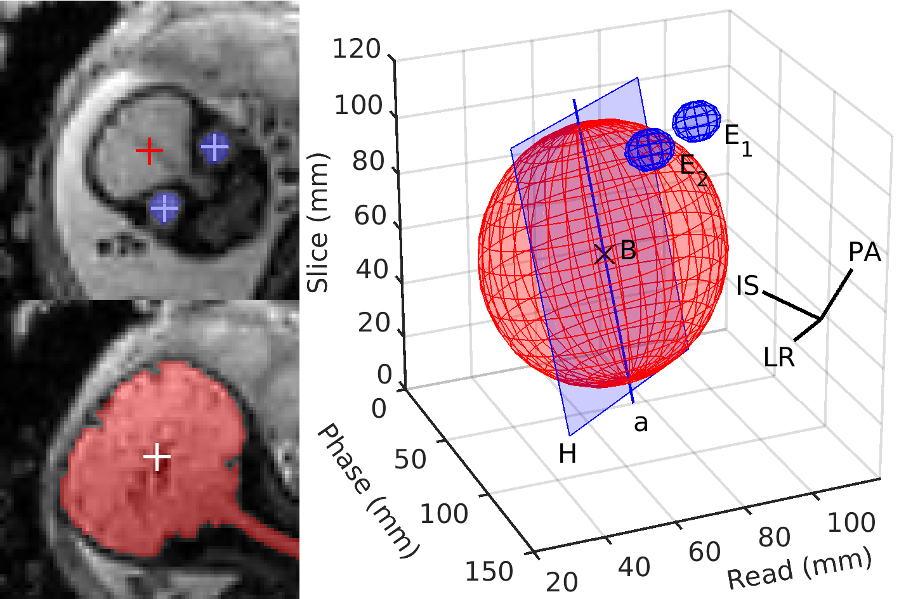

# Rapid head‐pose detection for automated slice prescription of fetal‐brain MRI



## Synopsis

This project includes an automated fetal-head pose detection from a single
full-uterus scout scan acquired as a stack of echo planar imaging (EPI) slices
with low resolution. Specifically, the algorithm derives the left–right,
posterior– anterior and inferior–superior axes of the arbitrarily oriented fetal
brain, which enables automatic prescription of a subsequent scan in standard
anatomical planes.  The brain and eyes are identified by detecting maximally
stable extremal regions (MSER) on each slice of the scout and combining them in
3D space. The location and shape of these landmarks provide sufficient
information to fully determine the head pose.

## Motivation

In fetal-brain magnetic resonance imaging (MRI), head-pose changes between
prescription and acquisition present a challenge to obtaining the standard
sagittal, coronal and axial views needed for clinical assessment
Unfortunately, subject motion limits acquisitions to thick slices that preclude
retroactive resampling to provide standard planes. Throughout the session,
technologists therefore repeat incrementally rotated stack-of-slices scans,
deducing the head pose from the previous stack until they obtain appropriately
oriented images. The algorithm seeks to address this inefficient workflow.

## Requirements

MATLAB version 9.1/R2016b or later is required. If needed, the pre-compiled MEX
function for MSER detection can be rebuilt by running `mex mser.cpp` in MATLAB.

## Example

For a demo showcasing the different stages of the algorithm, run `demo`. The
`printstats` script compares the landmarks derived by the algorithm to manually
localized eye and brain centers.

## Test data

The included test data comprise 41 EPI stacks from fetuses at 26-37 weeks'
gestation. Except for [ep2d_34.nii.gz](data/ep2d_34.nii.gz) and
[ep2d_41.nii.gz](data/ep2d_34.nii.gz), the pipeline should accurately detect
the head pose.

## FreeSurfer scripts

The IO scripts in the [freesurfer](freesurfer) directory are subject to the
[FreeSurfer Software License Agreement](freesurfer/LICENSE.txt). For more
information about FreeSurfer see https://surfer.nmr.mgh.harvard.edu.

## Further reading

A detailed description of the pipeline is freely available online. If you use
part of the data or code provided, please consider citing it:

[Rapid head-pose detection for automated slice prescription of fetal-brain MRI](https://doi.org/10.1002/ima.22563).
Hoffmann M, Abaci Turk E, Gagoski B, Morgan L, Wighton P, Tisdall MD, Reuter M, Adalsteinsson E, Grant PE, Wald LL, van der Kouwe AJW.
International Journal of Imaging Systems and Technology (IMA), in press, 2021.

```bibtex
@article{hoffmann2021rapid,
    title={Rapid head-pose detection for automated slice prescription of fetal-brain MRI},
    author={Hoffmann, Malte and Abaci Turk, Esra and Gagoski, Borjan and Morgan, Leah and Wighton, Paul and Tisdall, M Dylan and Reuter, Martin and Adalsteinsson, Elfar and Grant, P Ellen and Wald, Lawrence L and van der Kouwe, André JW},
    journal={International Journal of Imaging Systems and Technology},
    year={2021},
    publisher={Wiley Online Library}
}
```
